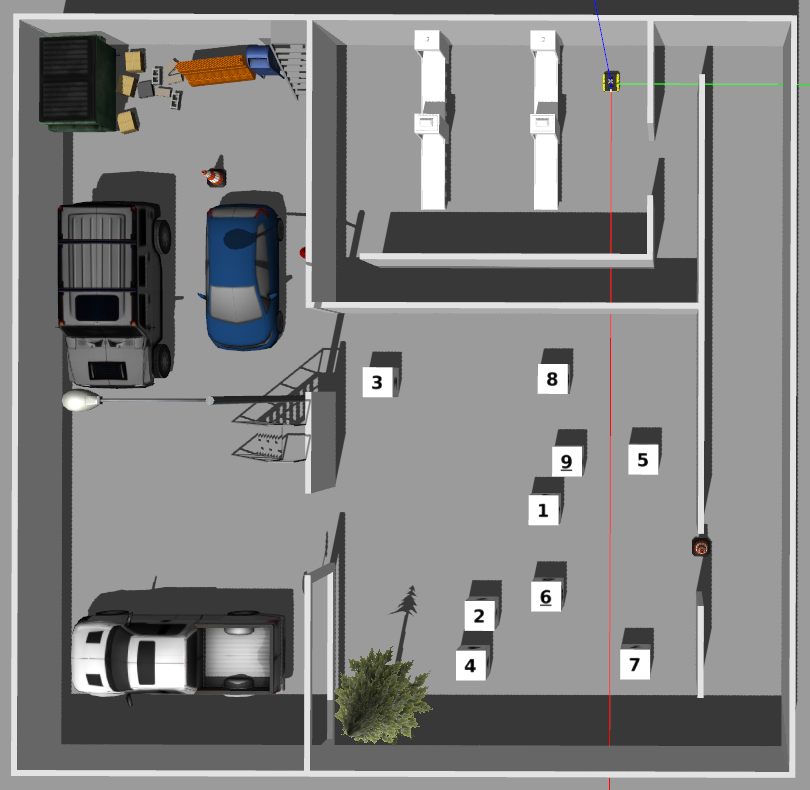
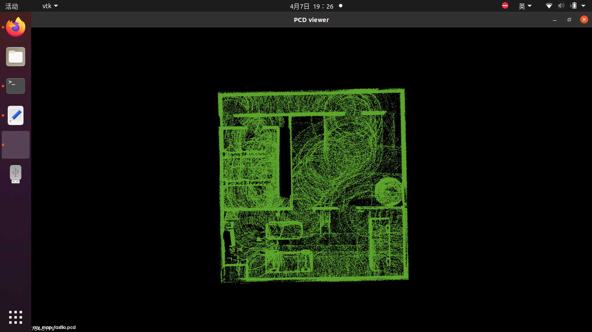
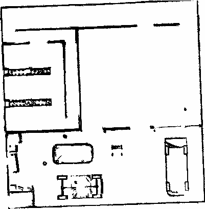
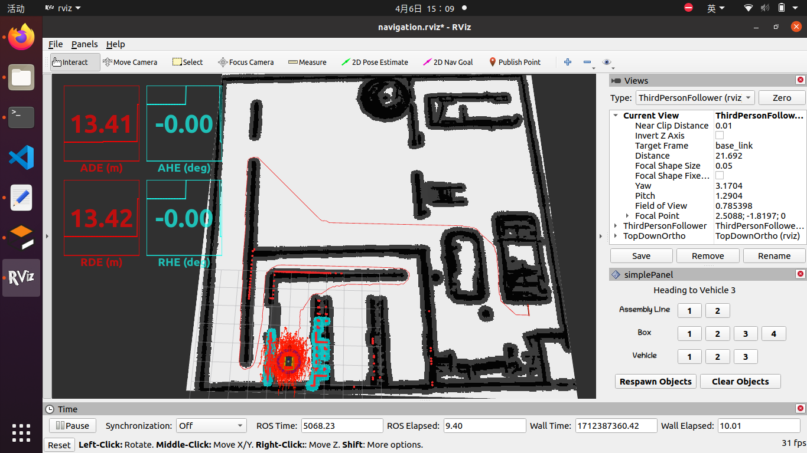

# ME5413 Final Project

NUS ME5413 Autonomous Mobile Robotics Final Project by Group 5
> Authors: Wang Yiwen, Tang Haodi, Zhang Xinming, Min Jixin, Ma Ziheng, Tian Tan




## Table of Contents
- [Project Decription](#1)
- [Prerequisites](#2)
- [Execution](#3)
- [Acknowledge](#4)

<h2 id="1"> 1. Project Decription</h2>

In this mini-factory environment, there are:
* 3 target areas
* 1 restricted area

The **aim** of the project is to design a robot navigation software stack that :  
* From the starting point, move to the given pose within each area in sequence:
  * Assembly Line: 1, 2
  * Random Box: 1, 2, 3, 4
  * Delivery Vehicle 1, 2, 3

Two main tasks included: **Mapping** & **Navigation**

<h2 id="2"> 2. Prerequisites</h2>

### 2.1 **Ubuntu** and **ROS**
* Ubuntu >= 18.04
* ROS    >= Melodic. [ROS Installation](http://wiki.ros.org/ROS/Installation)

### 2.2 **PCL && Eigen**
* PCL    >= 1.8,   Follow [PCL Installation](http://www.pointclouds.org/downloads/linux.html).
* Eigen  >= 3.3.4, Follow [Eigen Installation](http://eigen.tuxfamily.org/index.php?title=Main_Page).

### 2.3 **livox_ros_driver**
* Follow [livox_ros_driver Installation](https://github.com/Livox-SDK/livox_ros_driver).

*Remarks:*
- **livox_ros_driver** must be installed and **sourced** as FAST-LIO must support Livox serials LiDAR firstly.
- How to source? Add the line `source $Licox_ros_driver_dir$/devel/setup.bash` to the end of file `~/.bashrc`, where `$Licox_ros_driver_dir$` is the directory of the livox ros driver workspace (should be the `ws_livox` directory if you completely followed the livox official document).

### 2.4 imu_tools
```
sudo apt-get install ros-noetic-imu-tools
```

### 2.5 navigation stack
```
sudo apt-get install ros-noetic-navigation
```

<h2 id="3"> 3. Execution</h2>

### Part 1 Mapping

#### 3.1.1 Build
```
cd ~/ME5413_Final_Project
catkin_make
```
Add `source ~/ME5413_Final_Project/devel/setup.bash` to your `.bashrc` file

#### 3.1.2 Run FAST-LIO
```
# First terminal
roslaunch me5413_world world.launch

# Second terminal
roslaunch me5413_world mapping_fastlio.launch

# If you want to use A-LOAM
roslaunch me5413_world mapping_aloam.launch
```


#### 3.1.3 Convert pcd pointcloud to grid map

Firstly, change the filepath in `run.launch` to your own path (in the `src/pcdtopgm/launch/`)
```
# One terminal
roslaunch pcd2pgm run.launch

# Open another terminal where you want to save the converted map
rosrun map_server map_saver
```   



#### 3.1.4 EVO evaluation
```
# Record trajectory
rosbag record /gazebo/ground_truth/state /Odometry -o EVO_perform.bag
```  
#Using EVO to evaluate the mapping performence 
evo_ape bag EVO_perform.bag /gazebo/ground_truth/state /Odometry -r full -va --plot --plot_mode xy


### Part 2 Navigation
#### 3.2.1 Build
```
cd ~/ME5413_Final_Project
catkin_make
```
*Remarks:*
1. Uncomment corresponding algorithm you want to use in `src/me5413_world/launch/move_base.launch`
2. The parameters of planning algorithms and costmap are in corresponding `params` files.


#### 3.2.2 Run navigation
```
# First terminal
roslaunch me5413_world world.launch

# Second terminal
roslaunch me5413_world navigation.launch
``` 
Click "Assembly Line 2" or "Vehicle 3", you a seen a planned global and local path


Click "Box 2", you can seen Jackal move to a preset point and start object tracking


<h2 id="4"> Acknowledge</h2>

This project is finished from **NUS ME5413 Autonomous Mobile Robotics**

Many Thanks to **Professor. Marcelo** and **All TAs** @ NUS Advanced Robotics Centre
